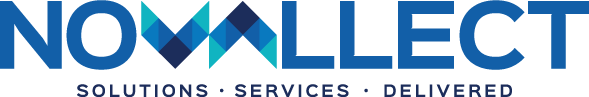
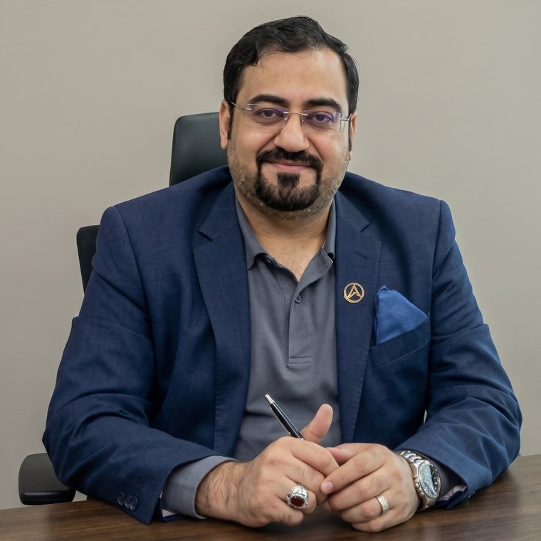
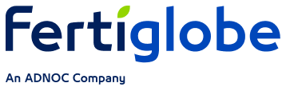
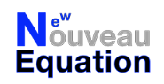
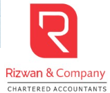

# Novallect — Company Content & Overview

> **Tagline:** Solutions. Services. Delivered.
> **Meta description:** Novallect: ERP, IT Solutions & Analytics for startups, SMEs and enterprises across the Middle East. Solutions. Services. Delivered.

This document collects all of the written content from the Novallect website along with explanations of what the company does. All accompanying images (logos, leadership, clients, partners) are in the `images/` folder next to this file.

**Contact:**
- Email: info@novallect.com (replies within one business day)
- Phone: +971 54 775 7765 (Sun–Thu, 9am–6pm GST)
- WhatsApp: https://wa.me/971547757765
- Location: Gulf & Middle East

**Brand logos:**

| Colour (light backgrounds) | White (dark backgrounds) |
|---|---|
|  |  |

---

## 1. What Novallect Does (Overview)

Novallect is a Middle East–based technology partner that helps **startups, SMEs and enterprises** modernise with confidence. The company brings deep SAP & ERP know-how, broad IT capability, and sharp analytics together **under one roof**, owning the outcome from first conversation to long after go-live.

The offering is organised around **four connected service pillars**, delivered by one accountable team:

1. **ERP** — SAP & business process systems
2. **IT Solutions** — Technology that scales with you
3. **Analysis** — Business intelligence & reporting
4. **Consulting** — Value-added services (with trusted partners)

The founding belief: *technology should make business easier, not harder.* Too many companies are sold complex systems they never fully use and are then left to figure out the rest alone. Novallect does it differently — right-sized solutions, end-to-end delivery, and accountability for the result.

---

## 2. Home Page

### Hero

**Badge:** ERP · IT SOLUTIONS · ANALYTICS

**Headline:** Smarter Systems. **Stronger Decisions.**

**Lead:** Novallect helps startups, SMEs and enterprises across the Middle East modernise with reliable SAP & ERP systems, future-ready IT solutions, and analytics that turn data into confident decisions.

**Buttons:** Contact Us · Explore Services

**Trust strip:** *Enabling growth for businesses across the Gulf and beyond* — with client logos (Fertiglobe, Mian International, Anwaar Group).

**Floating feature cards:**
- **SAP & ERP** — Implemented & supported
- **Cloud & IT** — Secure infrastructure
- **Power BI** — Live dashboards
- **Cybersecurity** — Always protected

### Stats band

| Stat | Label |
|---|---|
| 30+ | Years of combined experience |
| 10+ | Projects delivered |
| 15+ | Businesses supported |
| 8+ | Industries served |

### "What we do" — Four pillars. One trusted partner.

> From SAP-driven ERP and end-to-end IT to decision-ready analytics and expert consulting, everything your business needs to run smarter, under one roof.

(See the full service breakdown in Section 5.)

### Why Novallect — A partner that delivers, not just advises.

> "Solutions. Services. Delivered." isn't just a tagline. It's how we work with every client, from first call to long-term support.

| Feature | Description |
|---|---|
| **Built for the Middle East** | We understand how Gulf businesses operate, scale and report, and we tailor solutions to fit the region. |
| **End-to-end delivery** | From first consultation to go-live and beyond, one accountable partner across ERP, IT and analytics. |
| **SAP & ERP expertise** | Hands-on experience with SAP implementations, migrations and support that keep operations running. |
| **Decision-ready data** | Power BI dashboards and reporting that turn scattered data into clear, confident decisions. |
| **Secure & reliable** | Security-first infrastructure and proactive managed support so you can focus on growth. |
| **Scales with you** | Right-sized for startups today and ready to grow with you into a full enterprise tomorrow. |

### How we work — A simple path from idea to impact.

> A proven, four-step approach that keeps projects clear, predictable and focused on results.

1. **Discover** — We listen first, understanding your goals, challenges and current systems before recommending anything.
2. **Design** — We map the right ERP, IT or analytics solution and a clear plan, scoped to your size and budget.
3. **Deliver** — We implement, integrate and train your team, on time, with minimal disruption to your business.
4. **Support** — We stay on as your partner with ongoing support, optimisation and reporting as you grow.

### Closing call-to-action

**Kicker:** Ready when you are
**Title:** Let's build what's next for your business.
**Text:** Tell us about your goals and our team will map the right ERP, IT or analytics solution, no pressure, no jargon.
**Buttons:** Contact Us · Book a consultation

---

## 3. About Page

**Eyebrow:** About Novallect
**Title:** Technology partners who **actually deliver.**
**Lead:** We help startups, SMEs and enterprises across the Gulf modernise with confidence, combining deep SAP & ERP know-how, broad IT capability and sharp analytics under one roof.

### Our story — Built on experience. Driven by results.

Novallect was founded on a simple belief: technology should make business easier, not harder. Too many companies are sold complex systems they never fully use, and left to figure out the rest alone.

We do things differently. With over a decade of combined experience across SAP and ERP implementations, IT infrastructure, and business intelligence, our team partners with you end-to-end, from the first conversation to long after go-live.

Whether you're a startup setting up your first systems, an SME ready to scale, or an enterprise modernising operations, we deliver the right-sized solution and stay accountable for the outcome.

### What we stand for (values)

- Clarity over jargon
- Outcomes over output
- Long-term partnership
- Security & reliability first
- Practical, business-led advice
- Right-sized for every stage

### Mission / Vision / Promise

- **Our Mission** — To make enterprise-grade ERP, IT and analytics accessible to every ambitious business in the Middle East, delivered with clarity, not complexity.
- **Our Vision** — To be the region's most trusted technology partner, the team businesses call first when they want systems that actually work.
- **Our Promise** — Solutions. Services. Delivered. We measure ourselves on outcomes shipped and problems solved, not hours billed.

---

## 4. Leadership

**Section heading:** Operators first. **Advisors always.**
**Lead:** Our leadership's hands-on enterprise experience is why clients trust us with strategy, not just delivery.

### Nasir Rashid — Founder & Managing Director


**Tags:** SAP-Certified · PMP · Published Author

*"Our leadership's operating experience is why clients trust us with strategy, not just delivery."*

- 20+ years global SAP & enterprise transformation leadership
- Former SVP Finance & Systems Controller, GCC
- Operated across UAE, KSA, Bahrain, Singapore & Pakistan
- 12+ years leading SAP Finance & cross-module teams
- Former SAP consultant at SAP Arabia and Siemens

### Anwaar Awan — Director Admin & Legal



**Tags:** KAU Jeddah · Arabic Fluent · GCC Networks

*20+ years of entrepreneurial leadership, regulatory expertise, and stakeholder engagement across the GCC.*

- 20+ years entrepreneurial leadership across Pakistan & GCC
- Diversified portfolio: trading, healthcare, hospitality & professional services
- Active networks across Saudi ministries & municipal bodies
- Expert in MOMRAH, SASO & Saudi industrial licensing frameworks
- Multi-jurisdictional business partnerships across KSA & Pakistan

---

## 5. Services (Full Detail)

**Eyebrow:** Our Services
**Title:** Everything your business needs to **run smarter.**
**Lead:** Four connected service pillars (ERP, IT Solutions, Analysis and Consulting) delivered by one team that owns the outcome from start to finish.

### 5.1 ERP — SAP & business process systems

> End-to-end SAP and ERP services, from first implementation to ongoing support, that streamline how your business actually runs.

| Service | Description |
|---|---|
| SAP Implementation | Full-cycle SAP rollouts tailored to your processes. |
| SAP S/4HANA Migration | Move to S/4HANA with minimal disruption. |
| SAP Business One Consulting | The right-sized ERP for growing businesses. |
| SAP Support & Maintenance | Reliable AMS so your systems never miss a beat. |
| ERP Customization | Tailor your ERP to fit how your teams work. |
| ERP Integration | Connect ERP with your existing tools and data. |
| Business Process Automation | Automate repetitive workflows and approvals. |
| ERP Training & User Adoption | Get your people confident and productive fast. |

### 5.2 IT Solutions — Technology that scales with you

> Modern IT infrastructure, cloud, software and security for startups, SMEs and enterprises ready to grow with confidence.

| Service | Description |
|---|---|
| IT Infrastructure Setup | Build a stable, secure technology foundation. |
| Cloud Solutions & Migration | Move to the cloud, securely and cost-effectively. |
| Custom Software Development | Software built around your business needs. |
| Website & Web App Development | Fast, modern web experiences that convert. |
| Cybersecurity Solutions | Protect your data, systems and reputation. |
| System Integration | Make your platforms work together seamlessly. |
| Managed IT Support | Proactive support that keeps you running. |
| Digital Transformation Consulting | A clear roadmap to a more digital business. |

### 5.3 Analysis — Business intelligence & reporting

> Turn raw data into decisions with Power BI dashboards, financial analysis and reporting that leadership can actually act on.

| Service | Description |
|---|---|
| Power BI Dashboards | Live, interactive dashboards for every team. |
| Business Intelligence Reporting | One source of truth across your business. |
| Financial Analysis & Modeling | Clarity on margins, costs and cashflow. |
| Data Visualization | Complex data made simple to understand. |
| KPI Tracking Dashboards | Track what matters, in real time. |
| Sales & Operations Analytics | Spot trends and act before competitors. |
| Management Reporting | Board-ready reports without the manual work. |
| Forecasting & Performance Analysis | Plan ahead with data-backed forecasts. |

### 5.4 Consulting — Value Added Services

> In collaboration with our trusted partners, we extend a range of value-added services to support our clients beyond core business solutions.

| Service | Description |
|---|---|
| Workflow Design & Process Documentation | We help organizations design, improve, and document their current and future workflows, making business processes clearer, smoother, and easier to manage. |
| Project Management Services | Our experienced team supports clients in planning, managing, and implementing projects effectively from start to finish. |
| Outsourced Accounting & Bookkeeping | We help businesses maintain accurate and organized books of accounts using modern ERP systems, including SAP, so financial records remain clear and reliable. |
| Business Process Optimization | We identify gaps, delays, and inefficiencies in existing processes and recommend practical solutions to improve overall business performance. |
| Chart of Accounts Services | We provide customized Chart of Accounts services to help businesses organize financial transactions, generate ledger reports, and prepare accurate balance sheets. |
| Tax Services | We provide tax support including VAT return filing, VAT reconciliation with trial balance, internal VAT audits, e-invoicing, and related compliance services. |
| Feasibility Study Services | We prepare feasibility studies to help businesses assess new projects through market analysis, cost estimates, financial projections, risk review, and profitability assessment. |

**Services page closing CTA:**
**Kicker:** One partner, every pillar
**Title:** Not sure which service you need?
**Text:** Tell us your goal and we'll recommend the right mix of ERP, IT, analytics and consulting, with a clear plan and no obligation.

---

## 6. Clients

*Enabling growth for businesses across the Gulf and beyond.*

| Client | Logo |
|---|---|
| **Fertiglobe** |  |
| **Mian International** |  |
| **Anwaar Group** |  |

---

## 7. Partner Ecosystem

**Section heading:** A trusted network of **delivery partners.**
**Lead:** We extend our in-house expertise through carefully chosen technology, SAP delivery and advisory partners, so clients get specialist depth with a single point of accountability.

### Technology Partners

**Logos:** FastNexa, Orbin

 

**Capabilities:** AI & Automation · Cybersecurity · Cloud Services · IT Infrastructure · Software Development · Marketing & Innovation

### SAP Delivery Partner

**Logo:** Nouveau Equation



**Capabilities:** S/4HANA · Enterprise Transformation · SAP Implementation · Rollouts & Migration · Functional & Technical Consulting · AMS & Support · System Integration

### Advisory Partners

**Logos:** MKonnect Global, Rizwan & Company

 

**Capabilities:** Strategy · Financial Advisory · Digital Consulting · Corporate Restructuring · Accounting & Finance · Business Consulting · Project Feasibility

---

## 8. Contact Page

**Eyebrow:** Contact Us
**Title:** Let's talk about **your next move.**
**Lead:** Tell us where you want your business to go. We'll help you get there with the right ERP, IT or analytics solution, starting with a free, no-pressure consultation.

**Form:** Send us an enquiry — *Fill in the form and we'll be in touch shortly.* Fields: Full name*, Email*, Phone number*, Company, Service of interest, How can we help?* Privacy note: *We respect your privacy. Your details are only used to respond to your enquiry.*

**Success message:** *Thank you! Message received. Thanks for reaching out to Novallect. A member of our team will get back to you within one business day.*

**Direct channels — Prefer to reach out directly?** *Choose whatever's easiest, we're happy to help however you'd like to connect.*

| Channel | Value | Note |
|---|---|---|
| Email us | info@novallect.com | We reply within one business day |
| Call us | +971 54 775 7765 | Sun–Thu, 9am–6pm GST |
| WhatsApp | Chat with us (wa.me/971547757765) | Fastest way to reach us |
| Location | Gulf & Middle East | Serving the region |

**Consultation card:** Free 30-minute consultation — *No cost, no obligation, just a clear next step.*

---

## 9. Footer

**About blurb:** ERP, IT solutions and analytics that help startups, SMEs and enterprises across the Middle East run smarter and decide faster.

**Contacts:** info@novallect.com · +971 54 775 7765 · Gulf & Middle East

**Navigation:** Home · Services · About · Contact

**Copyright:** © Novallect. All rights reserved. · Solutions · Services · Delivered

---

## Image Index

All images live in the `images/` folder beside this document:

```
images/
├── logo/
│   ├── novallect-logo-color.png      (primary logo, light backgrounds)
│   └── novallect-logo-white.png      (logo for dark backgrounds)
├── team/
│   ├── nasir-rashid.jpg              (Nasir Rashid — Founder & Managing Director)
│   └── anwaar-pervaiz.jpg            (Anwaar Awan — Director Admin & Legal)
├── clients/
│   ├── fertiglobe.png                (Fertiglobe)
│   ├── mian-group.png                (Mian International)
│   └── anwaar-group.webp             (Anwaar Group)
└── partners/
    ├── fastnexa.png                  (FastNexa — Technology Partner)
    ├── orbin.png                     (Orbin — Technology Partner)
    ├── nouveau-equation.png          (Nouveau Equation — SAP Delivery Partner)
    ├── mkonnect.png                  (MKonnect Global — Advisory Partner)
    └── rizwan.png                    (Rizwan & Company — Advisory Partner)
```
